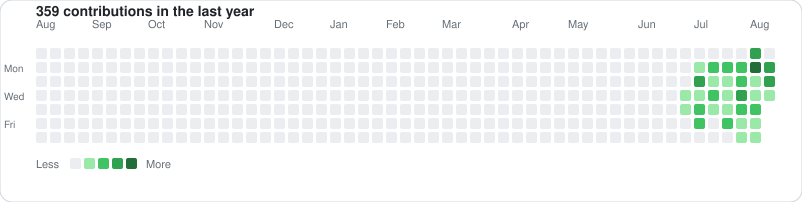
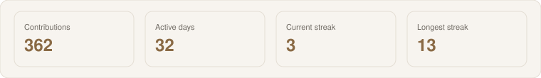

<!--
  Theme-adaptive profile README (light + dark).
  Contribution graphics are generated from GitHub's real contribution calendar.
  Note: GitHub only renders profile READMEs from a PUBLIC username/username repo.
-->

  <picture>
    <source media="(prefers-color-scheme: dark)" srcset="./assets/header-dark.svg" />
    
  </picture>

 

  <picture>
    <source media="(prefers-color-scheme: dark)" srcset="./assets/divider-dark.svg" />
    
  </picture>

## About

I design and ship backend systems for products that have to work in production — APIs, data paths, cloud, and the full-stack pieces that close the loop.

Fewer moving parts. Clear tradeoffs. Software that survives contact with users.

  <picture>
    <source media="(prefers-color-scheme: dark)" srcset="./assets/divider-dark.svg" />
    
  </picture>

## Stack

| | |
| :--- | :--- |
| **Backend** | Python · Flask · FastAPI · Node.js · Java |
| **Data** | PostgreSQL · DynamoDB · Redis · S3 |
| **Infra** | AWS · Docker · Kubernetes · Argo CD · Terraform |
| **Frontend** | TypeScript · React · Next.js |
| **Ops** | Datadog · Sentry · GitHub Actions |

  <picture>
    <source media="(prefers-color-scheme: dark)" srcset="./assets/divider-dark.svg" />
    
  </picture>

## Work

- Service platforms and APIs
- Event-driven AWS workloads
- Product surfaces in Next.js when ownership spans the stack
- Deploy, GitOps, and observability

Most of this lives in private product repositories. Public work will be pinned here when it ships.

  <picture>
    <source media="(prefers-color-scheme: dark)" srcset="./assets/divider-dark.svg" />
    
  </picture>

## Contributions

Same calendar as the graph on this GitHub profile — including private contributions.

  <picture>
    <source media="(prefers-color-scheme: dark)" srcset="./assets/contributions-dark.svg" />
    
  </picture>

 

  <picture>
    <source media="(prefers-color-scheme: dark)" srcset="./assets/stats-dark.svg" />
    
  </picture>

  <picture>
    <source media="(prefers-color-scheme: dark)" srcset="./assets/divider-dark.svg" />
    
  </picture>

### Clarity over ceremony.

Ship the hard part.

  <a href="https://github.com/prabhuatbhanzu">@prabhuatbhanzu</a>
  · <a href="https://bhanzu.com">bhanzu.com</a>
  · Bengaluru

