<!--
  Profile README for github.com/prabhuatbhanzu
  Dark-first · maintainable · no badge spam
  Update: Currently / Things I Build sections as work changes
-->

  

 

**I turn hard problems into software that ships.**

Backend-first. Product-minded. Production-focused.

 

  

 

## About

I spend most of my time in the backend — APIs, services, data paths, and the cloud wiring that keeps products alive.

When the product needs it, I cross the stack: TypeScript/React surfaces, payment flows, enrollment funnels, the boring glue that makes a feature actually usable.

I care less about “knowing every tool” and more about clear systems, sharp tradeoffs, and getting work into production.

  

## Engineering Stack

Organized by how I actually use them — not a résumé dump.

| | |
| :--- | :--- |
| **Backend** | Python · Flask · FastAPI · Node.js · Java |
| **Data** | PostgreSQL · DynamoDB · Redis · S3 |
| **Infrastructure** | AWS (Lambda, EKS) · Docker · Kubernetes · Argo CD · Terraform · GitHub Actions |
| **Frontend** | TypeScript · React · Next.js · Tailwind CSS |
| **Observability** | Datadog · Sentry |
| **Tools** | Git · GitHub · Linux · VS Code / Cursor |

<strong>Why this list</strong>

 

Pulled from systems I actively build and maintain — service platforms, lambdas, product frontends, and deployment pipelines. Anything I only touched once is left out on purpose.

  

## Things I Build

Systems over demos. Production over prototypes.

<table>
  <tr>
    <td width="50%" valign="top">
      <h3>Service platforms &amp; APIs</h3>
      

        Backend services for scheduling, payments, communications, LMS, and internal tooling —
        Flask/FastAPI services, shared libraries, and the contracts between them.
      

      <code>Python</code> · <code>Flask</code> · <code>FastAPI</code> · <code>AWS</code>
    </td>
    <td width="50%" valign="top">
      <h3>Event-driven cloud work</h3>
      

        Lambdas and async pipelines that move data, process webhooks, and keep product workflows
        running without babysitting.
      

      <code>AWS Lambda</code> · <code>DynamoDB</code> · <code>S3</code> · <code>Postgres</code>
    </td>
  </tr>
  <tr>
    <td width="50%" valign="top">
      <h3>Product frontends</h3>
      

        When ownership spans the full product surface — Next.js apps, enrollment flows,
        payments UX, and the details that decide whether a feature actually lands.
      

      <code>Next.js</code> · <code>React</code> · <code>TypeScript</code>
    </td>
    <td width="50%" valign="top">
      <h3>Ship &amp; run infrastructure</h3>
      

        Containers, GitOps, and cloud topology so “it works on my machine” becomes
        “it’s live and observable.”
      

      <code>Docker</code> · <code>Kubernetes</code> · <code>Argo CD</code> · <code>Terraform</code>
    </td>
  </tr>
</table>

> Most of this work lives in private product repos. Public project cards will land here as they ship.

<!-- Featured public repos (uncomment + edit when ready)

  
  

-->

  

## Currently

What I’m actively in the middle of (edit freely):

- Hardening backend services and async Lambda paths
- Shipping product enrollment / payments surfaces end-to-end
- Tightening deploy + observability loops (GitOps, metrics, alerts)

  

## Building in Public

The contribution graph is the point. Everything else is secondary.

  

 

  

 

  
  

Quiet graphs on a new account are normal. The design stays intact either way.

  

## Signature

  

 

### Ship the hard part.

Not demos. Not decks. **Working software in production.**

 

  <a href="https://github.com/prabhuatbhanzu">prabhuatbhanzu</a>
  · Backend · Full-Stack · Product

