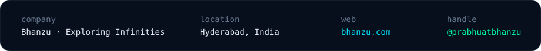
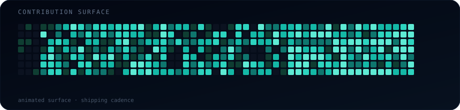

<!--
  github.com/prabhuatbhanzu — profile README
  Dark / neon / production aesthetic
  GitHub requires this repo PUBLIC for visitors to see the profile README.
-->

  

 

  

 

  

 

  
  
  

  

## About

Backend is home base. Products are the point.

I design APIs, data paths, and cloud systems — then stay close enough to the UI, payments, and enrollment surfaces that the thing actually ships.

Not a résumé. A working style:

- **Solve** the real constraint first
- **Build** the smallest system that holds
- **Ship** it where users can break it
- **Scale** only what survives

  

## Engineering Stack

  

<strong>Exact tools in rotation</strong>

 

| Layer | Stack |
| :--- | :--- |
| **Backend** | Python · Flask · FastAPI · Node.js · Java |
| **Data** | PostgreSQL · DynamoDB · Redis · S3 |
| **Infrastructure** | AWS (Lambda, EKS) · Docker · Kubernetes · Argo CD · Terraform · GitHub Actions |
| **Frontend** | TypeScript · React · Next.js · Tailwind CSS |
| **Observability** | Datadog · Sentry |
| **Tools** | Git · GitHub · Linux · Cursor |

  

## Things I Build

Production systems — not demo folders.

<table>
<tr>
<td width="50%" valign="top">

### Service platforms & APIs
Scheduling, payments, communications, LMS, internal tooling.
Shared libraries. Clear contracts. Boring reliability.

`Python` · `Flask` · `FastAPI` · `AWS`

</td>
<td width="50%" valign="top">

### Event-driven cloud work
Lambdas, webhooks, async pipelines that keep product workflows moving without babysitting.

`Lambda` · `DynamoDB` · `S3` · `Postgres`

</td>
</tr>
<tr>
<td width="50%" valign="top">

### Product frontends
Enrollment flows, payments UX, Next.js surfaces — when owning the full path is what gets it shipped.

`Next.js` · `React` · `TypeScript`

</td>
<td width="50%" valign="top">

### Ship & run infrastructure
Containers, GitOps, cloud topology, observability loops.

`Docker` · `Kubernetes` · `Argo CD` · `Terraform`

</td>
</tr>
</table>

> Most work lives in private product repos. Public pins land here as they ship.

  

## Currently

- Hardening backend services + async Lambda paths
- Shipping enrollment / payments surfaces end-to-end
- Tightening GitOps + observability loops

  

## Building in Public

The heatmap is the centerpiece. It moves on purpose.

  

 

  

 

  

 

  

 

  
  

New accounts start quiet. The design stays loud.

  

## Signature

  

 

### Ship the hard part.

Not demos. Not decks. **Working software in production.**

 

  <a href="https://github.com/prabhuatbhanzu">@prabhuatbhanzu</a>
  · <a href="https://bhanzu.com">bhanzu.com</a>
  · Hyderabad
  · Backend · Full-Stack · Product

