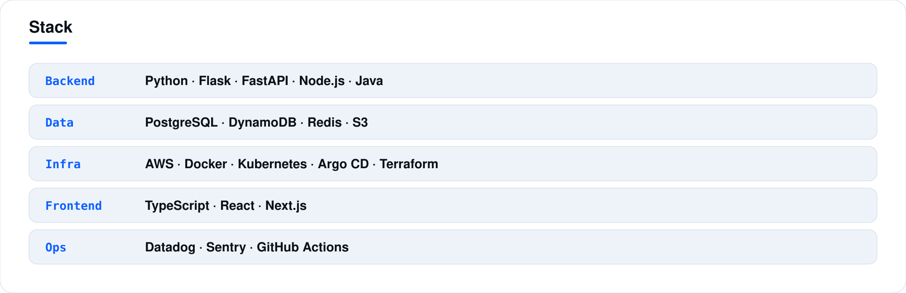
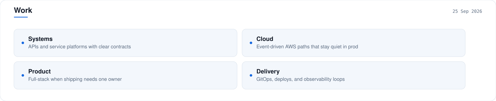
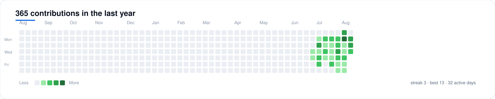

<!--
  Theme-adaptive profile (cool slate/blue).
  High-res SVGs (1800px) for sharp text on large screens.
  Light/dark follow prefers-color-scheme automatically.
-->

  <picture>
    <source media="(prefers-color-scheme: dark)" srcset="./assets/v3/header-dark.svg" />
    
  </picture>

 

  <picture>
    <source media="(prefers-color-scheme: dark)" srcset="./assets/v3/divider-dark.svg" />
    
  </picture>

 

  <picture>
    <source media="(prefers-color-scheme: dark)" srcset="./assets/v3/about-dark.svg" />
    
  </picture>

 

  <picture>
    <source media="(prefers-color-scheme: dark)" srcset="./assets/v3/stack-dark.svg" />
    
  </picture>

 

  <picture>
    <source media="(prefers-color-scheme: dark)" srcset="./assets/v3/work-dark.svg" />
    
  </picture>

 

  <picture>
    <source media="(prefers-color-scheme: dark)" srcset="./assets/v3/divider-dark.svg" />
    
  </picture>

 

  <picture>
    <source media="(prefers-color-scheme: dark)" srcset="./assets/v3/contributions-dark.svg" />
    
  </picture>

 

  <picture>
    <source media="(prefers-color-scheme: dark)" srcset="./assets/v3/footer-dark.svg" />
    
  </picture>

 

  
    <a href="https://bhanzu.com">bhanzu.com</a>
    ·
    <a href="https://github.com/Exploring-Infinities">Exploring Infinities</a>
    ·
    <a href="https://github.com/prabhuatbhanzu">@prabhuatbhanzu</a>
  

