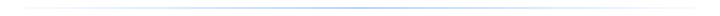
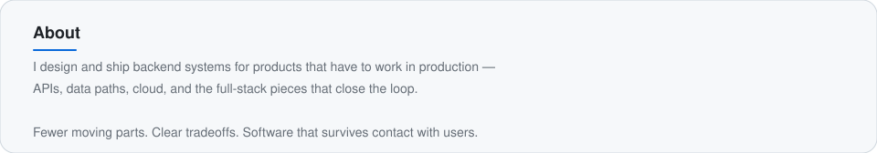
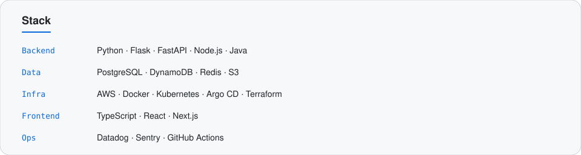
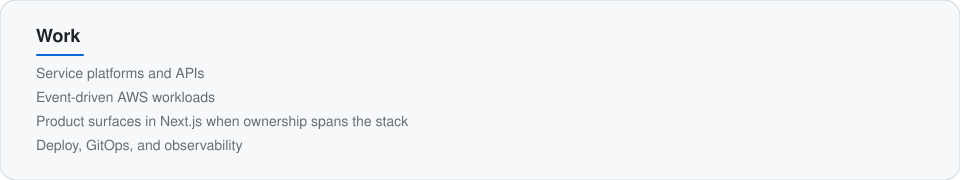

<!--
  Theme-adaptive profile README.
  Light/dark assets switch automatically with the visitor's GitHub theme (prefers-color-scheme).
  No page refresh required.
-->

  <picture>
    <source media="(prefers-color-scheme: dark)" srcset="./assets/header-dark.svg" />
    
  </picture>

 

  <picture>
    <source media="(prefers-color-scheme: dark)" srcset="./assets/divider-dark.svg" />
    
  </picture>

 

  <picture>
    <source media="(prefers-color-scheme: dark)" srcset="./assets/about-dark.svg" />
    
  </picture>

 

  <picture>
    <source media="(prefers-color-scheme: dark)" srcset="./assets/stack-dark.svg" />
    
  </picture>

 

  <picture>
    <source media="(prefers-color-scheme: dark)" srcset="./assets/work-dark.svg" />
    
  </picture>

 

  <picture>
    <source media="(prefers-color-scheme: dark)" srcset="./assets/divider-dark.svg" />
    
  </picture>

 

  <picture>
    <source media="(prefers-color-scheme: dark)" srcset="./assets/footer-dark.svg" />
    
  </picture>

   
  
    <a href="https://bhanzu.com">bhanzu.com</a>
    · <a href="https://github.com/Exploring-Infinities">Exploring Infinities</a>
    · <a href="https://github.com/prabhuatbhanzu">@prabhuatbhanzu</a>
  

