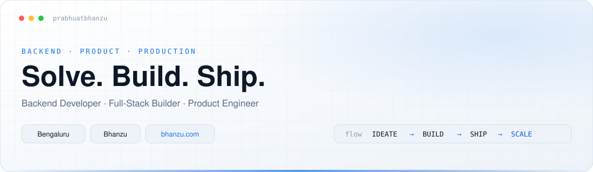
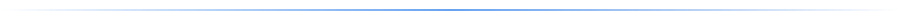
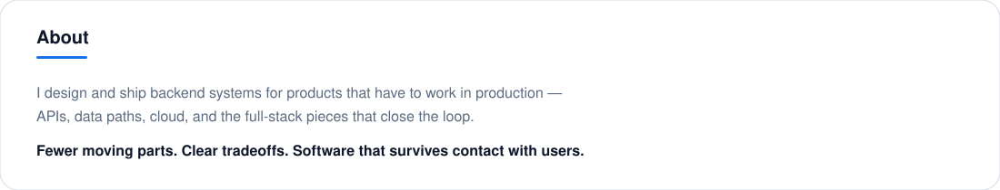
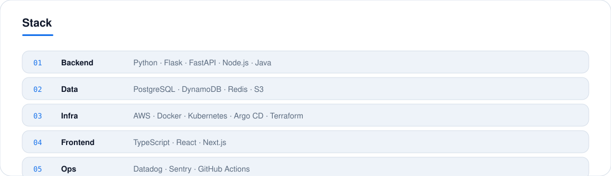

<!--
  Theme-adaptive profile (cool slate/blue only).
  Assets under assets/v2 to avoid stale CDN cache of older banners.
  Switches with prefers-color-scheme — no refresh needed.
-->

  <picture>
    <source media="(prefers-color-scheme: dark)" srcset="./assets/v2/header-dark.svg" />
    
  </picture>

 

  <picture>
    <source media="(prefers-color-scheme: dark)" srcset="./assets/v2/divider-dark.svg" />
    
  </picture>

 

  <picture>
    <source media="(prefers-color-scheme: dark)" srcset="./assets/v2/about-dark.svg" />
    
  </picture>

 

  <picture>
    <source media="(prefers-color-scheme: dark)" srcset="./assets/v2/stack-dark.svg" />
    
  </picture>

 

  <picture>
    <source media="(prefers-color-scheme: dark)" srcset="./assets/v2/work-dark.svg" />
    
  </picture>

 

  <picture>
    <source media="(prefers-color-scheme: dark)" srcset="./assets/v2/divider-dark.svg" />
    
  </picture>

 

  <picture>
    <source media="(prefers-color-scheme: dark)" srcset="./assets/v2/footer-dark.svg" />
    
  </picture>

 

  
    <a href="https://bhanzu.com">bhanzu.com</a>
    ·
    <a href="https://github.com/Exploring-Infinities">Exploring Infinities</a>
    ·
    <a href="https://github.com/prabhuatbhanzu">@prabhuatbhanzu</a>
  

